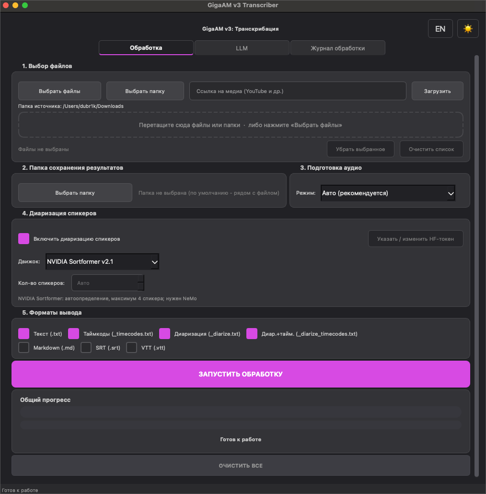
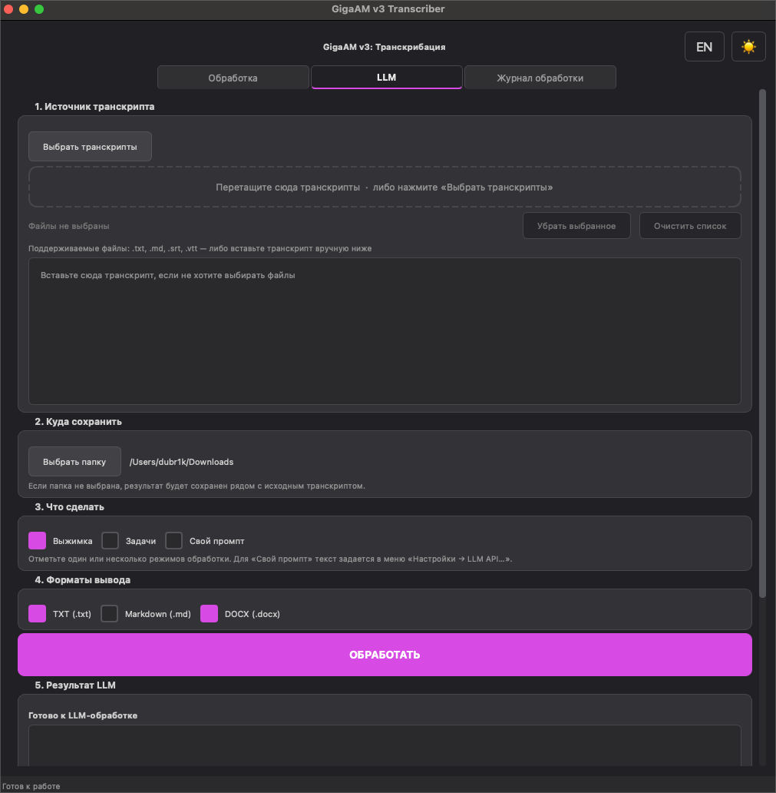
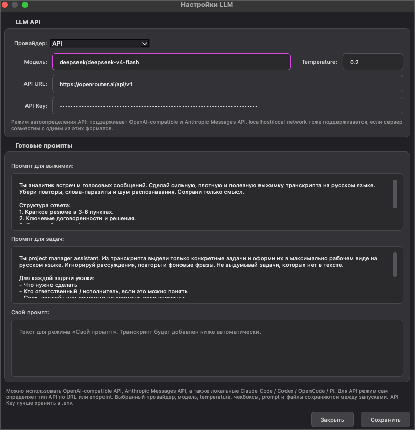

# GigaAM v3 Transcriber

[](https://www.python.org/)
[](https://www.riverbankcomputing.com/software/pyqt/)
[](https://fastapi.tiangolo.com/)
[](https://www.docker.com/)
[](https://github.com/dubr1k/GigaAMGUI/stargazers)

**🇷🇺 Русский** · [🇺🇸 English](README_EN.md)

Транскрибация русской речи из аудио и видео на базе **GigaAM-v3**. Один сервисный слой, пять интерфейсов: Desktop GUI, CLI, REST API, Web GUI и terminal TUI.

> GigaAM Transcriber — полноценный workflow для расшифровки, экспорта, диаризации и LLM-постобработки, а не только обёртка над моделью.

## Содержание

- [Возможности](#возможности)
- [Быстрый старт](#быстрый-старт)
- [Интерфейсы](#интерфейсы)
- [Конфигурация](#конфигурация)
- [Интеллектуальная подготовка аудио](#интеллектуальная-подготовка-аудио)
- [ASR backend](#asr-backend)
- [Офлайн-сборки](#офлайн-сборки)
- [Структура](#структура)
- [Скриншоты](#скриншоты)
- [Благодарности](#благодарности)

## Возможности

- Пакетная обработка файлов и папок, рекурсивный поиск, drag & drop, загрузка через `yt-dlp`.
- Экспорт: `txt`, `txt_timecodes`, `txt_diarize`, `txt_diarize_timecodes`, `md`, `srt`, `vtt`.
- Выбираемая диаризация: `pyannote`, ONNX PyAnnote + WeSpeaker или NVIDIA Streaming Sortformer v2.1.
- Автоматическая диагностика качества, консервативная очистка и safe fallback без сдвига таймкодов.
- Ускорение MLX RNN-T на Apple Silicon; CPU, CUDA, Intel XPU и MPS.
- LLM-постобработка: выжимки, задачи и свои промпты.
- Провайдеры LLM: OpenAI-compatible API, Claude Code, Codex, OpenCode, Pi и произвольный CLI.
- RU/EN, светлая/тёмная тема, журнал, stage-aware progress и отмена очереди.
- Web UI с авторизацией, SSE-прогрессом, восстановлением задач и Docker hardening.

## Быстрый старт

### 1. Установите зависимости

```bash
git clone https://github.com/dubr1k/GigaAMGUI.git
cd GigaAMGUI
cp .env.example .env
python -m pip install -r requirements.txt
ffmpeg -version
```

### 2. Укажите Hugging Face token

```env
HF_TOKEN=your_huggingface_token_here
```

Для диаризации нужно принять условия моделей `pyannote/speaker-diarization-3.1` и `pyannote/segmentation-3.0`.

### Опционально: NVIDIA Sortformer

В полной macOS `.app` Sortformer и NeMo уже включены. При запуске проекта из
исходников Sortformer устанавливается отдельно, чтобы не добавлять тяжёлый NeMo
в базовую установку:

```bash
python -m pip install -r requirements-sortformer.txt
python cli.py --diarize --diarization-backend sortformer -f audio.wav
```

Используется `nvidia/diar_streaming_sortformer_4spk-v2.1` с официальными
high-latency параметрами model card. Модель сама определяет активных
спикеров, поддерживает максимум четыре голоса и не требует `HF_TOKEN`.
Диаризация не зависит от ASR-модели: она проверена с `v3_e2e_rnnt`,
`multilingual_ctc` (220M) и `multilingual_large_ctc` (600M). Обе CTC-модели
работают через PyTorch backend.
Рекомендуется CUDA; CPU работает значительно медленнее. На Apple Silicon
Sortformer запускается на MPS; если конкретная операция NeMo не выполнится на
MPS, приложение один раз повторит диаризацию на CPU и покажет причину fallback
в журнале. Модель (~471 МБ) загружается после первого нажатия «Начать обработку»
с выбранным Sortformer и затем остаётся в пользовательском кэше.
NeMo из Space (`2.5.3`) намеренно не используется из-за исправленных в новых
релизах уязвимостей; optional-файл фиксирует проверенную безопасную ветку 2.7.
Для Web GUI соберите расширенный образ: `INSTALL_SORTFORMER=1 docker compose build gigaam-web`.

## Интерфейсы

| Интерфейс | Запуск | Для чего |
|---|---|---|
| Desktop GUI | `python app.py` | Обычная интерактивная работа |
| CLI | `python cli.py -f audio.wav -o output` | Скрипты и автоматизация |
| REST API | `python api.py` | Интеграции; docs: `http://127.0.0.1:8000/docs` |
| Web GUI | `docker compose up -d --build gigaam-web` | Локальная web-панель: `http://127.0.0.1:8001/` |
| TUI *(preview)* | `cd tui && cargo run --release` | Терминальная интерактивная очередь |

### TUI

```bash
curl -fsSL https://raw.githubusercontent.com/dubr1k/GigaAMGUI/main/scripts/install_tui.sh | bash
gigaam
```

## Конфигурация

### Папка данных и моделей

Все крупные загрузки можно направить на выбранный диск единым параметром
`GIGAAM_DATA_DIR`. Внутри автоматически создаются `runtimes` и отдельные
подкаталоги `models/gigaam`, `models/huggingface`, `models/onnx`,
`models/torch`, `models/nemo` и `models/deepfilter`. Это включает PyTorch
runtime, GigaAM, ONNX/MLX, Pyannote/Sortformer, NeMo и DeepFilterNet.

- **Desktop GUI:** `Настройки → Папка данных и моделей…`. Portable-сборка также
  предлагает выбрать папку до первой загрузки. После смены папки нужен перезапуск;
  уже загруженные модели намеренно не перемещаются автоматически.
- **GUI/CLI:** `python app.py --data-dir /mnt/large/GigaAMData` или
  `python cli.py --data-dir /mnt/large/GigaAMData ...`.
- **TUI:** `gigaam --data-dir /mnt/large/GigaAMData`.
- **REST API/Web:** задайте `GIGAAM_DATA_DIR` до запуска сервера. Для Docker
  Compose эта переменная означает путь **на хосте**:

```bash
GIGAAM_DATA_DIR=/mnt/large/GigaAMData docker compose up -d --build gigaam-web
```

Узкие переменные (`HF_HOME`, `HUGGINGFACE_HUB_CACHE`, `TRANSFORMERS_CACHE`,
`TORCH_HOME`, `NEMO_HOME`, `ONNX_MODEL_DIR`, `GIGAAM_RUNTIME_DIR`, `GIGAAM_CONFIG_DIR`,
`GIGAAM_PYTORCH_MODEL_DIR`, `GIGAAM_DEEPFILTER_DIR`) сохраняют приоритет, если
нужно разместить отдельный компонент иначе. В Windows путь моделей/runtime не
должен содержать кириллицу из-за ограничений некоторых нативных DLL.

Небольшие пользовательские настройки остаются в системном config-каталоге, чтобы
смена диска не сбрасывала язык, токены и параметры обработки. Для полностью
самостоятельной конфигурации её можно отдельно перенести через `GIGAAM_CONFIG_DIR`.

Для Web UI задайте в `.env`:

```env
WEB_SECRET=change_me
WEB_USERNAME=admin
WEB_PASSWORD=replace_with_strong_password
```

Для RTX 50xx / Blackwell сначала установите совместимый PyTorch:

```bash
python -m pip install torch==2.8.0 torchvision==0.23.0 torchaudio==2.8.0 --index-url https://download.pytorch.org/whl/cu128
python -m pip install -r requirements.txt
```

## Интеллектуальная подготовка аудио

По умолчанию `AUDIO_PREPROCESSING_MODE=auto`. Перед ASR приложение измеряет
громкость, noise floor, приблизительный SNR, clipping, тишину, DC offset,
spectral flatness и низкочастотный шум. Детерминированная policy выбирает одно
из действий:

- pass-through для уже качественной записи;
- только нормализацию для тихой записи;
- мягкий FFmpeg high-pass/denoise для умеренного шума;
- DeepFilterNet для сильного широкополосного шума;
- отказ от enhancement при клиппинге, почти пустой записи или неуверенном результате.

После обработки кандидат измеряется повторно. Он используется только если
quality gate подтверждает улучшение без роста клиппинга, потери речи и изменения
длительности. ASR получает выбранную дорожку, а диаризация — исходный canonical
WAV: это сохраняет тембр спикеров, границы реплик и таймкоды. Паузы физически не
удаляются.

DeepFilterNet запускается официальным self-contained Rust binary версии `0.5.6`.
Он скачивается с GitHub Releases только при первом обнаружении тяжёлого шума,
проверяется по закреплённому SHA-256 и хранится в runtime cache. Python-пакет
DeepFilterNet не устанавливается и не конфликтует с NumPy 2. Поддерживаются
Windows x64, macOS Intel/Apple Silicon и Linux x64/arm64. При недоступной сети,
неподдерживаемой платформе или любой ошибке транскрибация продолжится с исходной
дорожкой.

```env
AUDIO_PREPROCESSING_MODE=auto  # off | auto | light | denoise
# GIGAAM_DEEPFILTER_DIR=/writable/executable/cache
```

```bash
python cli.py --audio-preprocessing auto -f noisy.wav
python cli.py --audio-preprocessing off -f studio.wav
```

## ASR backend

`auto` на macOS Apple Silicon использует [gigaam-mlx](https://github.com/aystream/gigaam-mlx), затем при необходимости переключается на PyTorch. На остальных платформах `auto` пока сохраняет PyTorch как проверенный default. Новый backend `onnx` использует `onnx-asr==0.12.0`, не импортирует PyTorch и поддерживает CPU, CUDA, TensorRT, CoreML и DirectML.

В portable-сборках 1.3.1 ускорение ONNX согласовано с выбранным устройством:

- Windows/Linux содержат один `onnxruntime-gpu`; его `auto` использует
  `CUDAExecutionProvider → CPUExecutionProvider`. CUDA/cuDNN берутся из
  выбранного сменного PyTorch runtime (`cu124`/`cu128`), поэтому ASR и
  Sortformer не расходятся по устройствам. CPU остаётся встроенным fallback;
- macOS содержит обычный `onnxruntime`; `auto` использует
  `CoreMLExecutionProvider → CPUExecutionProvider`;
- DirectML и TensorRT остаются явными advanced-настройками и используются
  только когда установленный ORT действительно предоставляет такой provider.

Выбор CPU не скачивает CUDA runtime. Если CUDA runtime уже выбран и установлен,
приложение активирует его до обнаружения providers и вызывает preload
CUDA/cuDNN. Фактическая provider chain отображается в журнале подготовки.

```bash
python cli.py --backend auto -f audio.wav
python cli.py --backend mlx -f audio.wav
python cli.py --backend onnx --onnx-provider auto -f audio.wav
python cli.py --backend pytorch -f audio.wav
```

Те же настройки доступны в Desktop GUI и Web UI. REST API принимает их как
необязательные query-параметры; без них используется серверная конфигурация:

```bash
curl -H "X-API-Key: $GIGAAM_API_KEY" \
  -F "file=@audio.wav" \
  "http://127.0.0.1:8000/api/v1/transcribe?asr_backend=onnx&asr_model=v3_e2e_rnnt&onnx_provider=coreml"
```

Список допустимых значений и активная конфигурация: `GET /api/v1/asr/options`.
Настройка, отличающаяся от серверного default, получает изолированный loader
задачи и не перенастраивает backend параллельных запросов.

ONNX-диаризация также доступна без PyTorch и HF_TOKEN:

```bash
python cli.py --backend onnx --diarize --diarization-backend onnx -f audio.wav
```

Она сохраняет powerset-классы перекрывающейся речи, извлекает WeSpeaker embeddings и выполняет constrained clustering. Pyannote и Sortformer оставлены как проверяемые fallback-backend-ы: ONNX станет default только после прохождения локальных WER/CER и DER/JER ворот качества. На native Windows Sortformer запускается через ONNX Runtime без NeMo; на Linux/macOS официальный NeMo backend используется, когда он установлен, иначе автоматически выбирается тот же portable ONNX runtime. На Windows/Linux ONNX Sortformer использует CUDA выбранного runtime и CPU fallback; на macOS — CoreML и CPU fallback.

Сравнение на локальном лицензированном корпусе:

```bash
python scripts/benchmark_asr_backends.py corpus/asr.json --backend onnx --backend pytorch --output asr-metrics.json
python scripts/benchmark_diarization_backends.py corpus/diarization.json --backend onnx --backend pyannote --output diarization-metrics.json
```

## Офлайн-сборки

Каждый релиз выходит в двух вариантах:

- **обычный** — после нажатия «Начать обработку» проверяет выбранную цепочку,
  показывает скачивание/загрузку, device/provider и fallback в журнале и
  докачивает недостающие модели (и PyTorch runtime, если он нужен выбранному
  PyTorch/NeMo/CUDA-сценарию);
- **офлайн** (`*-offline.zip`) — рядом с исполняемым файлом лежит папка
  `models` с базовой ONNX-цепочкой: распознавание, VAD и
  Pyannote+WeSpeaker-диаризация.
  Такой сборке не нужны ни сеть, ни токен Hugging Face, ни PyTorch.

Распакуйте архив целиком и запускайте бинарник из распакованной папки: модели
ищутся рядом с ним. Приложение само выбирает `onnx` и для распознавания, и для
диаризации — явная настройка в `.env` или переменной окружения по-прежнему
имеет приоритет. Папка офлайн-моделей используется только для чтения, а
докачанные позже модели (multilingual, MLX, Pyannote, Sortformer) попадают в доступный для
записи кэш приложения.

Собрать такой набор самостоятельно:

```bash
python scripts/build_offline_models.py --output offline/models/hf
```

## Структура

```text
GigaAMGUI/
├── app.py                 # PyQt desktop app
├── cli.py                 # scripting CLI
├── api.py                 # REST API
├── src/                   # core, services, GUI mixins, utilities
├── tui/                   # Ratatui frontend
├── web/                   # FastAPI Web UI
├── tests/
├── packaging/
├── assets/
├── Dockerfile
└── docker-compose.yml
```

## Скриншоты

| Обработка | LLM | Настройки LLM |
|---|---|---|
|  |  |  |

## Благодарности

- [SaluteDevices / GigaAM](https://github.com/salute-developers/GigaAM)
- [GigaAM-v3 on Hugging Face](https://huggingface.co/ai-sage/GigaAM-v3)
- [aystream / gigaam-mlx](https://github.com/aystream/gigaam-mlx)
- [istupakov / onnx-asr](https://github.com/istupakov/onnx-asr) — за лёгкую кроссплатформенную реализацию распознавания речи на ONNX
- [NVIDIA Streaming Sortformer v2.1](https://huggingface.co/nvidia/diar_streaming_sortformer_4spk-v2.1)
- [Scrybl / Sortformer v2.1 ONNX](https://huggingface.co/Scrybl/diar_streaming_sortformer_4spk-v2.1) — закреплённый ONNX-экспорт для native Windows
- [parakeet-rs](https://github.com/altunenes/parakeet-rs) — MIT, референс потокового Sortformer ONNX
- [DeepFilterNet](https://github.com/Rikorose/DeepFilterNet) — MIT, optional neural noise suppression
