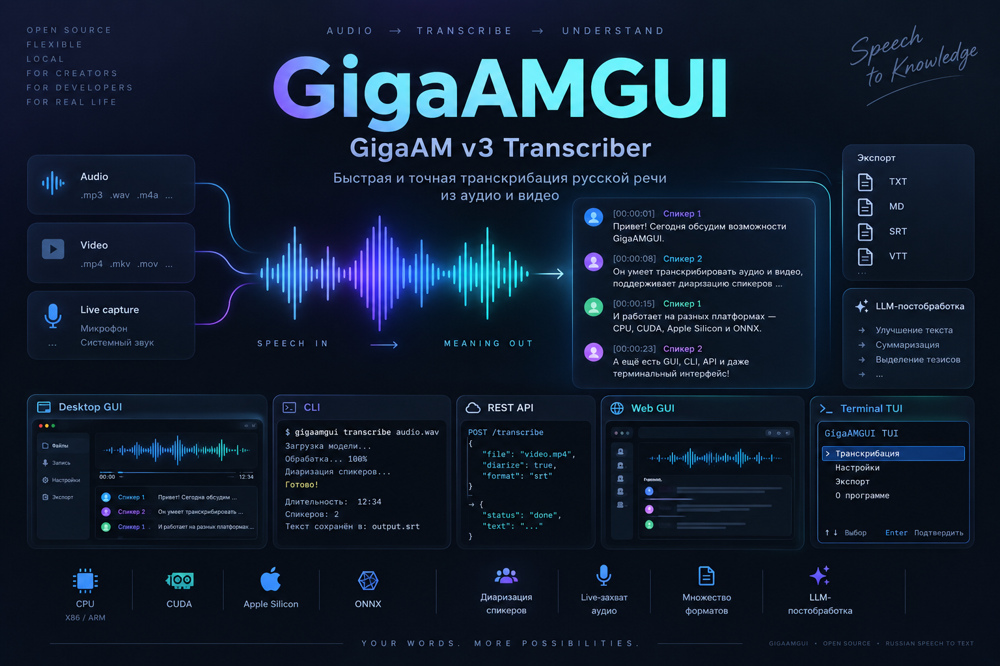
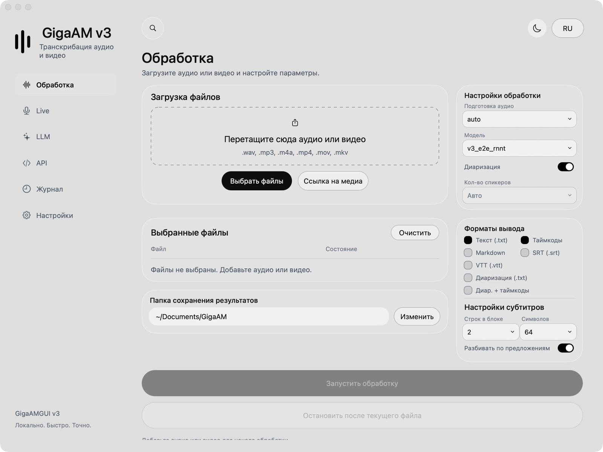
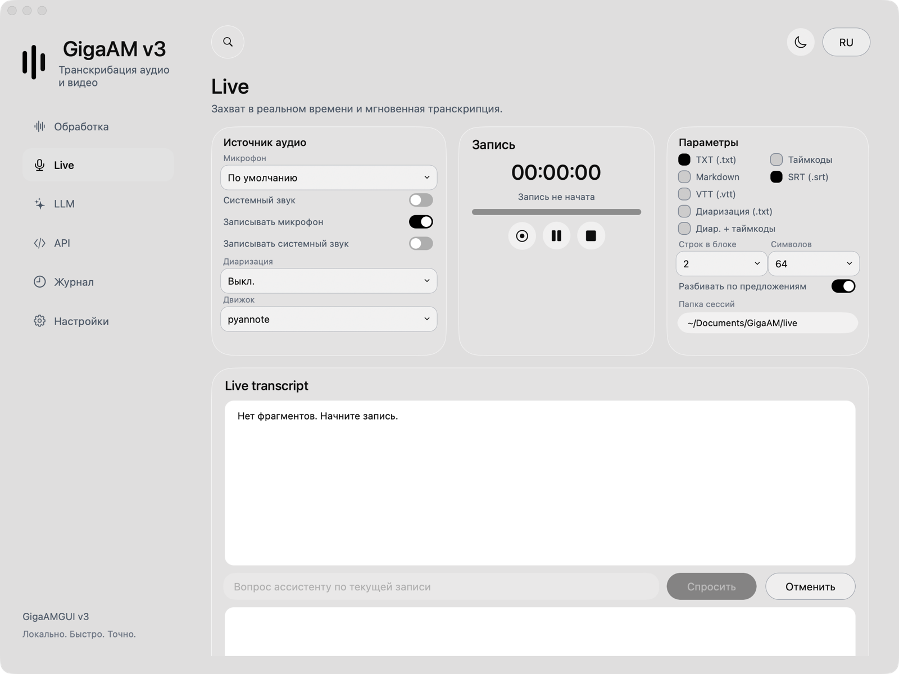
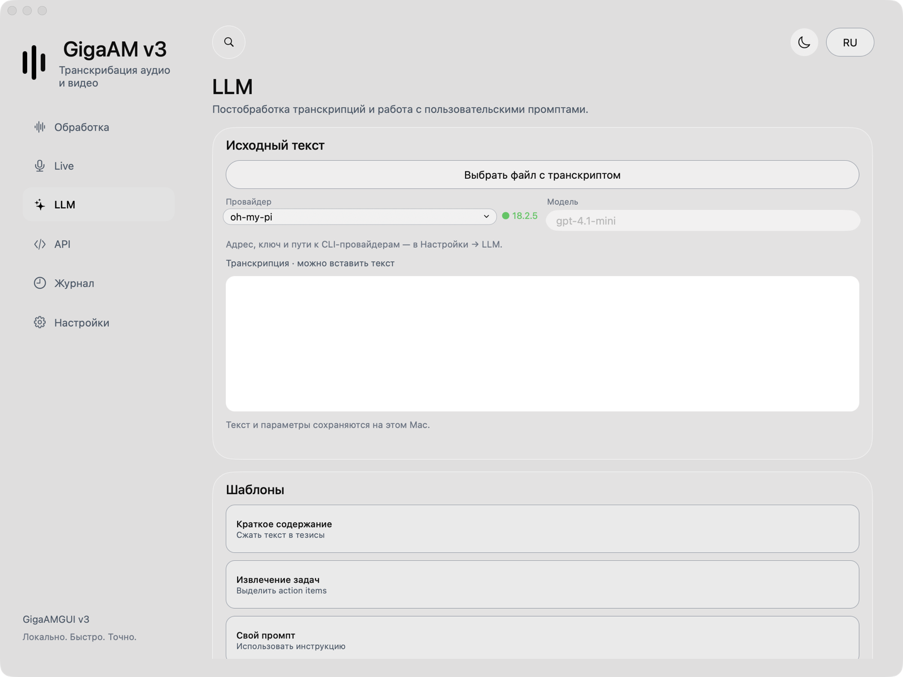
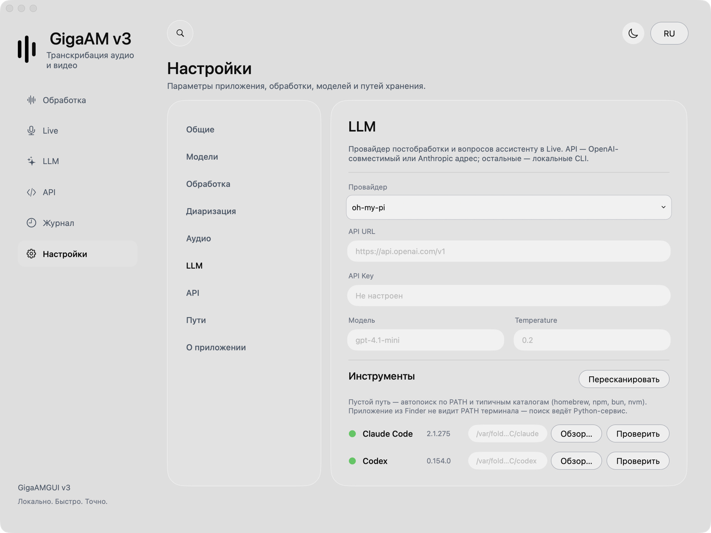
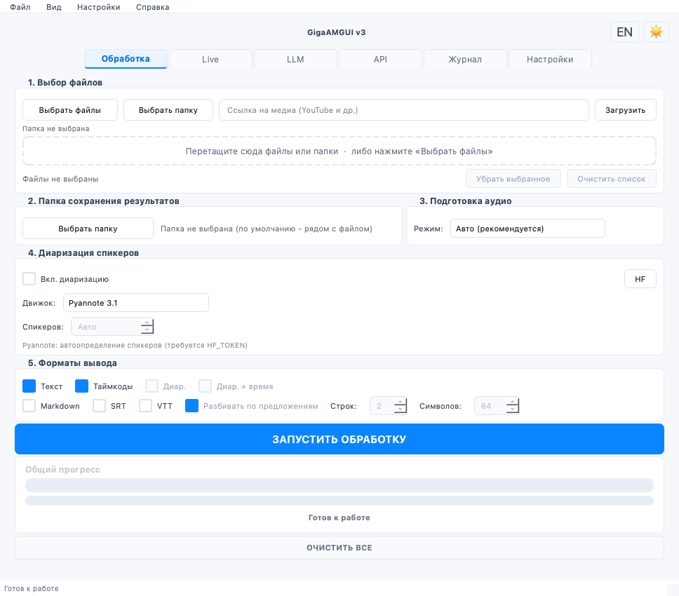
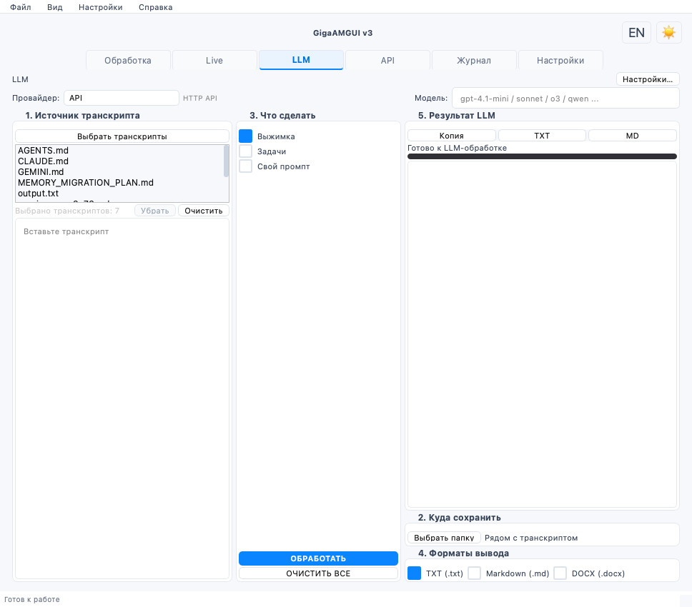
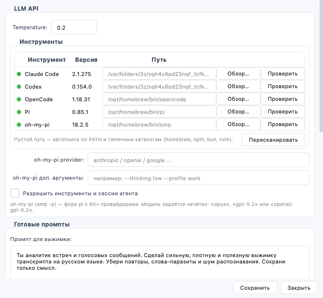
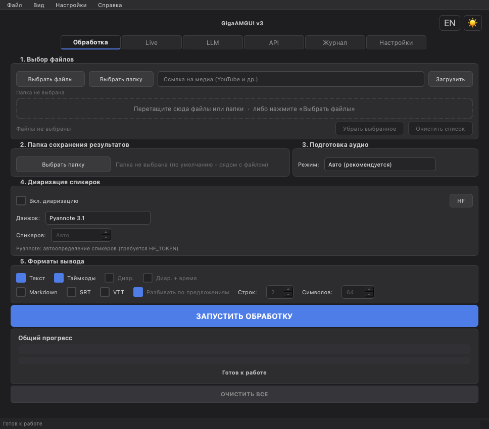

<p align="center">
  
</p>

# GigaAM v3 Transcriber

[](https://www.python.org/)
[](https://www.riverbankcomputing.com/software/pyqt/)
[](#gigaam-liquid--нативное-приложение-для-macos)
[](https://fastapi.tiangolo.com/)
[](https://www.docker.com/)
[](https://github.com/dubr1k/GigaAMGUI/stargazers)

**🇷🇺 Русский** · [🇺🇸 English](README_EN.md)

Программа для расшифровки русской речи из аудио и видео на модели
**GigaAM-v3** от SaluteDevices. Работает локально: файлы никуда не
отправляются. Умеет разделять говорящих, делать субтитры, чистить шум и
пересказывать расшифровку через LLM.

Один и тот же движок доступен в шести интерфейсах: нативное приложение для
macOS (**GigaAM Liquid**), классическое десктоп-приложение на PyQt для
Windows/macOS/Linux, командная строка, REST API, веб-панель и терминальный TUI.

## Содержание

- [Как это выглядит](#как-это-выглядит)
- [Что умеет](#что-умеет)
- [Установка готовых сборок](#установка-готовых-сборок)
- [GigaAM Liquid — нативное приложение для macOS](#gigaam-liquid--нативное-приложение-для-macos)
- [Запуск из исходников](#запуск-из-исходников)
- [Интерфейсы](#интерфейсы)
- [Live: запись и расшифровка в реальном времени](#live-запись-и-расшифровка-в-реальном-времени)
- [LLM: выжимки, задачи и свои промпты](#llm-выжимки-задачи-и-свои-промпты)
- [Субтитры](#субтитры)
- [Диаризация — кто говорит](#диаризация--кто-говорит)
- [Подготовка аудио и шумоподавление](#подготовка-аудио-и-шумоподавление)
- [Движок распознавания (ASR backend)](#движок-распознавания-asr-backend)
- [Где хранятся модели и данные](#где-хранятся-модели-и-данные)
- [Офлайн-сборки](#офлайн-сборки)
- [Веб-панель в Docker](#веб-панель-в-docker)
- [Структура репозитория](#структура-репозитория)
- [Благодарности](#благодарности)

## Как это выглядит

### GigaAM Liquid (macOS)

| Обработка | Live |
|---|---|
|  |  |

| LLM: провайдер найден автоматически | Настройки → LLM: найденные CLI |
|---|---|
|  |  |

Тёмная тема: [обработка](assets/screenshots/liquid-processing-dark.png) ·
[Live](assets/screenshots/liquid-live-dark.png) ·
[LLM](assets/screenshots/liquid-llm-dark.png) ·
[настройки LLM](assets/screenshots/liquid-settings-llm-dark.png).

### Классическое приложение (PyQt, Windows / macOS / Linux)

| Обработка | LLM |
|---|---|
|  |  |

| Настройки LLM: таблица инструментов | Тёмная тема |
|---|---|
|  |  |

## Что умеет

**Расшифровка**

- Пакетная обработка файлов и целых папок (с подпапками), drag & drop,
  загрузка по ссылке через `yt-dlp`.
- Экспорт в `txt`, `txt` с таймкодами, `md`, `srt`, `vtt`, а с диаризацией —
  текст с именами говорящих (с таймкодами и без).
- Три движка на выбор: MLX на Apple Silicon (самый быстрый на Mac), ONNX
  Runtime (без PyTorch, работает на CPU, CUDA, CoreML, DirectML) и PyTorch.
- Умная подготовка звука: приложение само оценивает запись и при
  необходимости нормализует громкость, убирает шум лёгким фильтром или
  DeepFilterNet — только если это реально улучшает результат.

**Говорящие и субтитры**

- Диаризация тремя способами: pyannote, ONNX (PyAnnote + WeSpeaker) или
  NVIDIA Streaming Sortformer v2.1.
- SRT/VTT режутся на короткие фразы по пунктуации и таймстампам слов;
  число строк и ширина строки настраиваются, не влияя на TXT/MD.

**Реальное время**

- Вкладка Live: микрофон, системный звук или оба сразу, отдельная дорожка
  на каждый источник, диаризация «на лету» или после остановки, плавающий
  оверлей с текстом и вопросами ассистенту.

**LLM-постобработка**

- Готовые режимы «Выжимка» и «Задачи» плюс свой промпт.
- Провайдеры: любой OpenAI-совместимый или Anthropic API, а также локальные
  CLI — Claude Code, Codex, OpenCode, Pi, oh-my-pi и произвольная команда.
- CLI-инструменты находятся автоматически (в том числе из homebrew, npm,
  bun, nvm — даже когда приложение запущено из Finder или Dock), их статус и
  версия видны в настройках.

**Прочее**

- Русский и английский интерфейс, светлая и тёмная темы, журнал событий,
  прогресс по стадиям, отмена очереди.
- Веб-панель с авторизацией, прогрессом по SSE, восстановлением задач после
  перезапуска и защищённым Docker-образом.

## Установка готовых сборок

Скачайте архив под свою систему со страницы
[Releases](https://github.com/dubr1k/GigaAMGUI/releases). У каждого релиза
две версии: **обычная** докачивает модели при первом запуске, **офлайн**
(`*-offline*`) содержит базовый набор ONNX-моделей и не требует ни сети, ни
токена Hugging Face — см. [Офлайн-сборки](#офлайн-сборки).

| Система | Что скачать |
|---|---|
| macOS, Apple Silicon — нативное приложение | `GigaAMLiquid-macos-arm64-<версия>.zip` |
| macOS, Apple Silicon — классическое PyQt | `GigaAMTranscriber-macos-app-<версия>.zip` |
| macOS, Intel | `GigaAMTranscriber-macos-x86_64-app-offline-<версия>.zip` (только офлайн, ONNX + CoreML, macOS 13+) |
| Windows x64 | `GigaAMTranscriber-windows-x64.exe` или `…-offline.zip` |
| Linux x64 | `GigaAMTranscriber-linux-x64` или `…-offline.zip` |

Сборки для macOS подписаны ad-hoc, поэтому при первом открытии Gatekeeper
может отказать. Откройте приложение через правый клик → «Открыть», либо
снимите карантин:

```bash
xattr -dr com.apple.quarantine /Applications/GigaAMLiquid.app
```

Windows-сборка портативная: распакуйте и запустите `.exe`. Путь к папке с
моделями не должен содержать кириллицу — некоторые нативные библиотеки с ней
не работают.

## GigaAM Liquid — нативное приложение для macOS

**GigaAM Liquid** — отдельный клиент на Swift/AppKit с интерфейсом в стиле
Liquid Glass (macOS 26; на macOS 13–15 используется обычное размытие).
Внутри архива один `GigaAMLiquid.app`: вся обработка выполняется встроенным
Python-движком, который лежит в `Contents/Resources` и запускается как
фоновый процесс. Отдельно ставить Python не нужно.

Что есть в приложении:

- **Обработка** — перетащите файлы или вставьте ссылку на медиа; форматы
  вывода, диаризация, число говорящих и настройки субтитров — на той же
  странице. Готовый текст и файлы — на странице «Результат».
- **Live** — микрофон и/или системный звук (ScreenCaptureKit), запись
  дорожек, расшифровка по мере записи, вопросы ассистенту по текущей записи.
- **LLM** — выжимка, задачи или свой промпт для любого транскрипта; рядом с
  выбранным провайдером показывается его статус (`● 18.2.5`, `○ не найден`).
- **Настройки → LLM** — таблица всех CLI-инструментов со статусом, версией и
  путём; кнопки «Обзор…», «Проверить», «Пересканировать»; аргументы и
  внутренний провайдер для каждого CLI; переключатель «Разрешить инструменты
  и сессии агента».
- **Журнал**, **API** (примеры запросов к REST-серверу), **Настройки**
  (модель, движок, диаризация, аудио, пути, тема, язык).

Разрешения: **Микрофон** — для записи голоса, **Запись экрана** — для
системного звука (так устроен ScreenCaptureKit). Токен Hugging Face и ключ
API хранятся в Связке ключей.

Собрать самостоятельно:

```bash
# движок (PyInstaller, 5–20 минут)
bash packaging/build_exe_mac.sh              # → dist/GigaAMTranscriber.app
# нативный клиент
swift build -c release --package-path macos/GigaAMLiquid
```

Точная сборка бандла (Info.plist, вложение движка, подпись) описана в
`.github/workflows/build.yml`, шаг «Assemble and verify app bundle». Для
разработки достаточно `swift run --package-path macos/GigaAMLiquid` из корня
репозитория — клиент найдёт `.venv/bin/python` проекта сам.

## Запуск из исходников

Нужен Python 3.10+ и `ffmpeg` в `PATH`.

```bash
git clone https://github.com/dubr1k/GigaAMGUI.git
cd GigaAMGUI
cp .env.example .env
python -m venv .venv && source .venv/bin/activate   # Windows: .venv\Scripts\activate
python -m pip install -r requirements.txt
ffmpeg -version
python app.py
```

Для диаризации через pyannote укажите в `.env` токен Hugging Face
(`HF_TOKEN=…`) и примите условия моделей `pyannote/speaker-diarization-3.1`
и `pyannote/segmentation-3.0`. ONNX-диаризация и Sortformer токена не
требуют.

Дополнительные наборы зависимостей:

```bash
python -m pip install -r requirements-live-macos.txt     # Live на macOS 13+
python -m pip install -r requirements-live-windows.txt   # Live на Windows (PyAudioWPatch)
python -m pip install -r requirements-live-linux.txt     # Live на Linux (+ libportaudio2 pulseaudio-utils libasound2-plugins)
python -m pip install -r requirements-sortformer.txt     # NVIDIA Sortformer (тянет NeMo)
python -m pip install -r requirements-macos-mlx.txt      # MLX на Apple Silicon
```

Для видеокарт RTX 50xx (Blackwell) сначала поставьте совместимый PyTorch:

```bash
python -m pip install torch==2.8.0 torchvision==0.23.0 torchaudio==2.8.0 --index-url https://download.pytorch.org/whl/cu128
python -m pip install -r requirements.txt
```

## Интерфейсы

| Интерфейс | Запуск | Когда удобен |
|---|---|---|
| GigaAM Liquid (macOS) | `GigaAMLiquid.app` | Повседневная работа на Mac |
| Классический GUI (PyQt) | `python app.py` | Windows, Linux, macOS |
| CLI | `python cli.py -f audio.wav -o output` | Скрипты и пакетная автоматизация |
| REST API | `python api.py` | Интеграции, совместим с OpenAI Audio API: [docs/API.md](docs/API.md) |
| MCP-сервер | `gigaam mcp` | ИИ-агенты (Claude Code, Codex, Cursor): [docs/MCP.md](docs/MCP.md) |
| Веб-панель | `docker compose up -d --build gigaam-web` | Сервер в локальной сети: `http://127.0.0.1:8001/` |
| TUI *(preview)* | `cd tui && cargo run --release` | Очередь задач в терминале |

Установить TUI одной командой:

```bash
curl -fsSL https://raw.githubusercontent.com/dubr1k/GigaAMGUI/main/scripts/install_tui.sh | bash
gigaam
```

Обновить: `gigaam --update` (сохраняет выбранную модель и не пересобирает
окружение; `--fresh` у установщика — переустановить с нуля). Версия:
`gigaam --version`. Если TUI запущен на машине, где уже установлен PyQt- или
Liquid-клиент (найден `user_settings.json`), настройки (backend, модель,
провайдер LLM, форматы, диаризация…) общие для обеих программ — выигрывает
тот, кто сохранил последним, другая программа подхватывает изменения при
следующем запуске.

**Интерфейс TUI 2.0.** Интерфейс по-русски по умолчанию; `/lang ru|en` (или
строка «Язык» в настройках, флаг `--lang en` при запуске) переключает язык и
сохраняет его в общую с настольным приложением настройку `language`. Четыре
вкладки — **Обработка**, **LLM**, **Настройки**, **Журнал** — переключаются
клавишами F1–F4, Tab/Shift+Tab или щелчком по заголовку. На вкладке «Обработка»
слева очередь файлов, справа панель параметров (движок, модель, форматы,
диаризация, спикеры, звук, папка): стрелка → переводит курсор на панель,
Enter или клик открывает меню значения. Строка «▶ Далее:» под основной областью
подсказывает следующий шаг (вставить путь → `s` запустить → `L` выжимка через
LLM → `r` показать ответ); `?` открывает справку со всеми клавишами и
командами. Мышь включена: клики по вкладкам, кнопкам, строкам очереди и
настроек, колёсико прокручивает списки; `/mouse off` (или строка «Мышь» в
настройках) отдаёт мышь терминалу для выделения текста — либо зажмите Shift
(Linux/Windows) или Option (macOS). `/settings` открывает вкладку «Настройки»
(это список строк: Enter или клик меняет значение), а не отдельное меню.

**Цветовые темы.** `/theme` без аргумента открывает прокручиваемый список
из 102 схем, `/theme dark-monokai` включает схему по имени (Tab дописывает
имя), строка «Тема» в настройках открывает тот же список, а флаг
`--theme NAME` задаёт схему на один запуск. Выбор хранится в
`tui_settings.json`. В комплекте `default` (прежние цвета), `mono` (только
цвета терминала, выделение — жирным и инверсией), наша `dark-hermes-pink` и
99 палитр из [oh-my-pi](https://github.com/can1357/oh-my-pi) (MIT, текст
лицензии — `tui/themes/LICENSE-oh-my-pi`): например `dark-tokyo-night`,
`dark-gruvbox`, `light-github`, `light-solarized`. Схемы `light-*` рассчитаны
на светлый фон терминала, `dark-*` — на тёмный.

**Headless / для агентов.** `gigaam transcribe FILE... [опции]` и
`gigaam llm FILE... --mode summary [опции]` работают без интерфейса: одна
строка на файл на stdout, `--json` — построчный поток событий воркера, коды
выхода `0`/`1`/`2`/`3` (`3` — воркер недоступен, см. `gigaam --update`).
Контракт для агентов — `skills/gigaam/SKILL.md`; `gigaam --install-skill`
ставит его в `~/.claude/skills`, `~/.codex/skills`, `~/.agents/skills`.

## Live: запись и расшифровка в реальном времени

Вкладка Live есть в Liquid и в PyQt. Источники — микрофон, системный звук
или оба одновременно, для каждого выбирается своё устройство. По желанию
сохраняются `mic.wav`, `system.wav` и, при двух источниках, `mix.wav`.
После остановки доступны те же форматы экспорта, что и при обычной
обработке.

Диаризация в Live работает в трёх режимах: выключена, анонимная оценка в
реальном времени (метки могут уточняться в последние 10 секунд) или полная
обработка после остановки. Кнопка «Оверлей» открывает плавающее окно поверх
других приложений с финальным и промежуточным текстом; там же можно задать
LLM вопрос по уже расшифрованному.

Платформы:

- **macOS 13+** — микрофон через `sounddevice` (разрешение Microphone),
  системный звук через ScreenCaptureKit (разрешение Screen Recording).
- **Windows** — `requirements-live-windows.txt` (PyAudioWPatch, loopback
  WASAPI).
- **Linux** — `requirements-live-linux.txt` плюс системные `libportaudio2`,
  `pulseaudio-utils`, `libasound2-plugins`. Системный звук берётся только из
  существующего monitor-источника PipeWire/PulseAudio: приложение находит
  его через `pactl`, открывает поток на ALSA-агрегате `pulse` и переключает
  на выбранный монитор через `move-source-output`. Если переключить не
  удалось, сессия завершается ошибкой, а не пишет микрофон вместо системного
  звука.

Портативные и офлайн-сборки уже содержат всё для Live (включая PortAudio на
Linux); команды выше нужны только при запуске из исходников.

## LLM: выжимки, задачи и свои промпты

Страница LLM принимает готовые транскрипты (файлы или вставленный текст) и
прогоняет их через выбранную модель в одном из режимов: **Выжимка**,
**Задачи** или **Свой промпт**. Результат сохраняется в `txt`, `md` или
`docx` рядом с транскриптом или в выбранную папку.

### Провайдеры

| Провайдер | Как работает |
|---|---|
| **API** | Любой OpenAI-совместимый endpoint или Anthropic Messages API. Тип определяется по URL. Ретраи на 429/5xx с учётом `Retry-After`. Google Gemini подключается через `https://generativelanguage.googleapis.com/v1beta/openai/`. |
| **Claude Code** | `claude -p` — локальный CLI Anthropic. |
| **Codex** | `codex exec` — CLI OpenAI. Модель выбирает сам клиент. |
| **OpenCode** | `opencode run`, модель в формате `provider/model`. |
| **Pi** | `pi -p`; можно задать внутренний provider (anthropic, openai, google…). |
| **oh-my-pi** | `omp -p` — форк pi с 60+ провайдерами; модель задаётся нечётко (`opus`, `gpt-5.2`, `openai/gpt-5.2`). |
| **Другое** | Своя команда: промпт передаётся последним аргументом и в stdin; напишите `{stdin}` в аргументах, чтобы передавать только через stdin. |

### Как находятся CLI

Приложение, запущенное из Finder, Dock или ярлыка, получает «пустой» системный
`PATH` и не видит `claude`, `omp` или `codex`, установленные через homebrew,
npm, bun или nvm. Поэтому поиск устроен так:

1. проверяется `PATH` процесса и типичные каталоги установки —
   `/opt/homebrew/bin`, `/usr/local/bin`, `~/.local/bin`, `~/.bun/bin`,
   `~/.npm-global/bin`, `~/.volta/bin`, `~/.cargo/bin`, все версии nvm, pnpm;
   на Windows — `%APPDATA%\npm`, scoop, bun, pnpm;
2. найденный бинарь запускается с `--version`; в настройках видны статус
   (`●` найден, `○` не найден, `⚠` не запускается) и версия;
3. тот же расширенный `PATH` получает и сам CLI, поэтому npm-обёртки
   `claude`/`opencode` находят `node`.

Пустое поле пути означает автопоиск. Кнопка «Обзор…» позволяет указать
бинарь вручную, «Проверить» — перепроверить один инструмент, «Пересканировать»
— все сразу. Для ненайденного инструмента показывается команда установки.

### Безопасный запуск

По умолчанию агентные CLI запускаются как обычный запрос к модели: без
инструментов и без сохранения сессии (`--no-tools --no-session` у pi/omp,
`--tools "" --no-session-persistence` у Claude Code, `run --pure` у
OpenCode). Выжимка транскрипта — не задача для coding-агента, и она не
должна засорять его историю. Переключатель **«Разрешить инструменты и сессии
агента»** снимает это ограничение.

Промпт передаётся через stdin, а не аргументом командной строки: длинные
транскрипты не упираются в лимит аргумента (128 КиБ на Linux).

**Аргументы** в настройках — дополнительные флаги командной строки, которые
добавляются к запуску как есть, например `--thinking low`. Обычно они не
нужны. **Provider** у Pi и oh-my-pi — внутренний поставщик модели, если нужно
переопределить настроенный в самом CLI.

## Субтитры

Настройки SRT/VTT находятся рядом с выбором форматов: число строк в блоке,
максимальная ширина строки и разбиение по предложениям. Они не влияют на
TXT и MD. CLI принимает те же параметры:

```bash
python cli.py -f audio.wav --format srt --format vtt \
  --subtitle-sentence-split --subtitle-max-lines 2 --subtitle-max-width 64
```

В TUI — команды `/subtitle-split on|off`, `/subtitle-lines 1..4`,
`/subtitle-width 20..100`, а также `/audio-mode auto|off|light|denoise`,
`/llm-file <путь>` (LLM по любому сохранённому транскрипту), `/llm-path`,
`/llm-provider-name`, `/llm-args`, `/llm-tools on|off` и хоткей `r` — открыть
вкладку LLM с ответами (Esc во время работы LLM отменяет запрос,
не убивая воркер).

При наличии таймстампов слов каждый cue получает точные границы; иначе время
распределяется внутри исходного сегмента распознавания. С диаризацией SRT
подписывает говорящего только при его смене (`Спикер №1:`), а VTT добавляет
стандартный `<v Спикер №1>` в каждый cue — в плеере он невидим, но нужен для
атрибуции и стилей.

## Диаризация — кто говорит

| Движок | Особенности |
|---|---|
| **pyannote** | Проверенный вариант; нужен `HF_TOKEN` и принятые условия моделей. |
| **ONNX** (PyAnnote + WeSpeaker) | Без PyTorch и токена; сохраняет перекрывающуюся речь, кластеризует embeddings. Используется в офлайн-сборках. |
| **NVIDIA Sortformer v2.1** | Сам определяет число говорящих (до четырёх); токен не нужен. Лучше на CUDA, на Apple Silicon работает через MPS с автоматическим откатом на CPU. Модель ~470 МБ скачивается при первом использовании. |

Sortformer в полной macOS-сборке уже включён; из исходников ставится через
`requirements-sortformer.txt` (NeMo 2.7 — версии из Space намеренно не
используются из-за исправленных позже уязвимостей). На Windows Sortformer
работает через ONNX Runtime без NeMo. Для веб-панели соберите расширенный
образ: `INSTALL_SORTFORMER=1 docker compose build gigaam-web`.

```bash
python cli.py --diarize --diarization-backend sortformer -f audio.wav
python cli.py --backend onnx --diarize --diarization-backend onnx -f audio.wav
```

Диаризация всегда получает исходную дорожку (без шумоподавления), поэтому
тембр говорящих и таймкоды не искажаются.

## Подготовка аудио и шумоподавление

Режим `AUDIO_PREPROCESSING_MODE=auto` (по умолчанию) перед распознаванием
измеряет громкость, уровень шума, SNR, клиппинг, тишину, DC-смещение и
спектральные признаки и выбирает одно из действий: ничего не менять,
нормализовать громкость, применить мягкий фильтр FFmpeg или включить
DeepFilterNet для сильного широкополосного шума. Обработанный вариант
проверяется повторно и берётся только если он действительно лучше — без
роста клиппинга, потерь речи и изменения длительности. Паузы не вырезаются.

DeepFilterNet — официальный Rust-бинарь `0.5.6`, который скачивается с
GitHub Releases при первом тяжёлом шуме, проверяется по SHA-256 и хранится в
кэше. Python-пакет DeepFilterNet не нужен. Если сети нет или платформа не
поддерживается, распознавание идёт по исходной дорожке.

```env
AUDIO_PREPROCESSING_MODE=auto   # off | auto | light | denoise
```

```bash
python cli.py --audio-preprocessing off -f studio.wav
```

## Движок распознавания (ASR backend)

| Backend | Где и зачем |
|---|---|
| `auto` | На Apple Silicon — MLX, на macOS Intel — ONNX, на остальных — PyTorch. |
| `mlx` | [gigaam-mlx](https://github.com/aystream/gigaam-mlx), самый быстрый вариант на Mac. |
| `onnx` | `onnx-asr`, без PyTorch. Провайдеры: CPU, CUDA, TensorRT, CoreML, DirectML. |
| `pytorch` | Классический движок; CPU, CUDA, Intel XPU, MPS. |

```bash
python cli.py --backend auto -f audio.wav
python cli.py --backend onnx --onnx-provider coreml -f audio.wav
```

В портативных сборках Windows/Linux ONNX использует CUDA выбранного
PyTorch-runtime (`cu124`/`cu128`) с откатом на CPU; macOS — CoreML → CPU.
DirectML и TensorRT включаются вручную и только если установленный ONNX
Runtime их предоставляет. Реальная цепочка провайдеров пишется в журнал.

### REST API (совместим с OpenAI)

`python api.py` поднимает сервер с контрактом OpenAI Audio API: клиенты
OpenAI SDK работают, поменяв `base_url` и ключ (печатается при первом старте).
Движок, провайдер и диаризация передаются полями формы (`asr_backend`,
`onnx_provider`, `diarize`, …); список доступных значений — `GET /v1/models`.

```bash
curl http://127.0.0.1:8000/v1/audio/transcriptions -H "Authorization: Bearer $GIGAAM_API_KEY" \
  -F "file=@audio.wav" -F "model=whisper-1" -F "response_format=srt" -F "asr_backend=onnx"
```

```python
from openai import OpenAI
client = OpenAI(base_url="http://127.0.0.1:8000/v1", api_key="gam_...")
print(client.audio.transcriptions.create(model="whisper-1", file=open("audio.wav", "rb")).text)
```

Ключ хранится хэшем в `.api_keys` (путь переопределяется `API_KEYS_FILE`);
сырое значение печатается один раз при первом старте — сохраните его сразу.
Тот же файл ключей использует `/mcp`.

Форматы ответа, стрим, ошибки и расширения — в [docs/API.md](docs/API.md).

> `api.py` — отдельный процесс. В `docker compose` поднимается **веб-панель**
> (`gigaam-web`), которая отдаёт свой интерфейс и `/mcp`, но **не** маршруты
> `/v1/*`. Нужен REST в контейнере — запускайте `api.py` рядом (см. ниже).

### MCP-сервер для агентов

Тот же движок доступен ИИ-агентам по Model Context Protocol: инструменты
`transcribe` (url / путь / base64 → текст, сегменты, говорящие, SRT/VTT),
`summarize` (выжимка, задачи, термины, свой промпт), `list_models`,
`list_llm_providers`, `server_status`; ресурсы `gigaam://models`,
`gigaam://status`; промпты `meeting_notes`, `subtitles_review`.

```bash
claude mcp add gigaam -- gigaam mcp                       # локально, stdio (входит в установку TUI)
claude mcp add --transport http gigaam https://gigaam-site.dubr1k.space/mcp \
  --header "Authorization: Bearer gam_..."                # удалённо: /mcp в api.py и веб-панели
```

Скиллы для агентов (`skills/gigaam`, `skills/gigaam-mcp`) ставятся командой
`gigaam --install-skill`. Клиенты, лимиты, ошибки и деплой за nginx — в
[docs/MCP.md](docs/MCP.md).
Пошаговая локальная настройка Claude Code, Codex, OMP, Pi, OpenCode и Hermes,
включая venv, скиллы и проверку протокола — [локальные harness](docs/LOCAL_HARNESSES.md).

Сравнить движки на своём корпусе:

```bash
python scripts/benchmark_asr_backends.py corpus/asr.json --backend onnx --backend pytorch --output asr-metrics.json
python scripts/benchmark_diarization_backends.py corpus/diarization.json --backend onnx --backend pyannote --output diarization-metrics.json
```

### macOS Intel

Для Intel-маков публикуется отдельный офлайн-ассет: `.app` плюс папка
`models`. Сборка без torch и mlx — распознавание, VAD и диаризация целиком
на ONNX Runtime (CoreML/CPU). Нужна macOS 13+. arm64-сборки на Intel не
запускаются: Rosetta работает в обратную сторону.

```bash
python -m pip install -r requirements-macos-x86_64.txt -r requirements-live-macos.txt
bash packaging/build_exe_mac_x86_64.sh
```

## Где хранятся модели и данные

Все крупные загрузки — PyTorch runtime, GigaAM, ONNX/MLX, pyannote,
Sortformer, NeMo, DeepFilterNet — можно направить на выбранный диск одним
параметром `GIGAAM_DATA_DIR`. Внутри создаются `runtimes` и
`models/{gigaam,huggingface,onnx,torch,nemo,deepfilter}`.

- **PyQt:** Настройки → «Папка данных и моделей…». Портативная сборка
  предлагает выбрать папку до первой загрузки. После смены нужен перезапуск;
  уже скачанные модели не переносятся автоматически.
- **Liquid:** переменная окружения `GIGAAM_DATA_DIR` (например, через
  `launchctl setenv GIGAAM_DATA_DIR /Volumes/Data/GigaAM`); встроенный движок
  читает её так же, как CLI.
- **CLI/GUI:** `python app.py --data-dir /mnt/large/GigaAMData`,
  `python cli.py --data-dir …`.
- **TUI:** `gigaam --data-dir …`.
- **REST API / Web:** задайте `GIGAAM_DATA_DIR` до запуска сервера.

Узкие переменные (`HF_HOME`, `HUGGINGFACE_HUB_CACHE`, `TRANSFORMERS_CACHE`,
`TORCH_HOME`, `NEMO_HOME`, `ONNX_MODEL_DIR`, `GIGAAM_RUNTIME_DIR`,
`GIGAAM_CONFIG_DIR`, `GIGAAM_PYTORCH_MODEL_DIR`, `GIGAAM_DEEPFILTER_DIR`)
имеют приоритет, если отдельный компонент нужно положить в другое место.
Небольшие пользовательские настройки (язык, токены, параметры обработки)
живут в системном config-каталоге и при смене диска не сбрасываются.

## Офлайн-сборки

Архивы `*-offline*` содержат рядом с исполняемым файлом папку `models` с
базовой ONNX-цепочкой: распознавание, VAD и диаризация PyAnnote + WeSpeaker.
Такой сборке не нужны сеть, токен Hugging Face и PyTorch. Распакуйте архив
целиком и запускайте из распакованной папки — модели ищутся рядом. Папка
офлайн-моделей только читается; всё, что скачивается позже (multilingual,
MLX, pyannote, Sortformer), попадает в обычный кэш приложения.

Собрать набор моделей самостоятельно:

```bash
python scripts/build_offline_models.py --output offline/models/hf
```

## Веб-панель в Docker

```bash
cp .env.example .env            # WEB_SECRET, WEB_USERNAME, WEB_PASSWORD
mkdir -p uploads results logs cache
docker compose up -d --build gigaam-web
curl -fsS http://127.0.0.1:8001/health
```

Контейнер слушает **8000**, Compose пробрасывает его на хост как
`127.0.0.1:8001` — reverse proxy настраивайте на 8001. Панель отдаёт и
MCP-эндпойнт `/mcp` (Streamable HTTP): ключ берётся из `API_KEYS_FILE`
(в Compose — `/data/.api_keys`, чтобы переживать пересоздание контейнера) и
печатается один раз в журнале при первом старте:

```bash
docker compose logs gigaam-web | grep -m1 'gam_'
```

Маршрутов `/v1/audio/transcriptions` в этом контейнере нет — это отдельный
сервис `api.py`. Фрагмент nginx для `/mcp` (SSE без буферизации, длинные
таймауты, `client_max_body_size`) — `deploy/nginx-mcp-location.conf`.

`GIGAAM_DATA_DIR` для Compose — путь **на хосте**; внутри контейнера он
монтируется как `/data`. Корневая файловая система контейнера read-only,
поэтому кэши (`HF_HOME`, `TORCH_HOME`, `NEMO_HOME`, `ONNX_MODEL_DIR`,
`GIGAAM_RUNTIME_DIR`) должны оставаться под `/data`.

При обновлении пересобирайте контейнер, но сохраняйте `GIGAAM_DATA_DIR`,
`uploads`, `results` и `logs` — модели и файлы пользователей лежат в этих
томах. Если каталоги создавались от root, дайте UID `1000` права на запись.
`src/` и `web/` монтируются в контейнер только для чтения, поэтому новый код
попадает внутрь без пересборки, а новые зависимости — нет: контейнер, упавший
после обновления с `ModuleNotFoundError`, лечится именно `build`, а не
`restart`. После обновления проверяйте `/health` и журнал:

```bash
docker compose build gigaam-web && docker compose up -d gigaam-web
docker compose ps gigaam-web
docker compose logs --tail=200 gigaam-web
```

В логе не должно быть `Read-only file system` или `VAD недоступен`.
Проверить, что GPU и диаризация в контейнере живы:

```bash
docker compose exec gigaam-web python -c "import torch; print(torch.cuda.is_available())"
docker compose exec gigaam-web python -c "from gigaam.model import GigaAMASR; print(hasattr(GigaAMASR, '_decode'))"
```

Второй вызов должен печатать `True`: без `_decode` ASR не отдаёт пословные
тайминги, и тогда разметка по говорящим схлопывается в одного спикера на весь
блок распознавания. Ревизия GigaAM закреплена в `Dockerfile` и обязана
совпадать с CI.

## Структура репозитория

```text
GigaAMGUI/
├── app.py                 # классический PyQt-клиент
├── cli.py                 # командная строка
├── api.py                 # REST API (FastAPI)
├── src/
│   ├── core/              # распознавание, диаризация, субтитры
│   ├── services/          # общий слой: транскрипция, LLM, реестр CLI (cli_tools.py)
│   ├── gui/               # PyQt-миксины
│   ├── live/              # захват и live-сессии
│   └── utils/             # ffmpeg, подготовка аудио, HTTP-клиент LLM
├── macos/GigaAMLiquid/    # нативный Swift-клиент для macOS
├── tui/                   # Ratatui-клиент
├── web/                   # веб-панель
├── packaging/             # PyInstaller-спеки и скрипты сборки
├── tests/
└── docs/                  # CHANGELOG, release notes, инструкции
```

Для разработчиков: правила проекта — в [AGENTS.md](AGENTS.md); список
изменений — в [docs/CHANGELOG.md](docs/CHANGELOG.md).

## Благодарности

- [SaluteDevices / GigaAM](https://github.com/salute-developers/GigaAM) и
  [GigaAM-v3 на Hugging Face](https://huggingface.co/ai-sage/GigaAM-v3)
- [aystream / gigaam-mlx](https://github.com/aystream/gigaam-mlx) — MLX-порт
  для Apple Silicon
- [istupakov / onnx-asr](https://github.com/istupakov/onnx-asr) — лёгкое
  кроссплатформенное распознавание на ONNX
- [NVIDIA Streaming Sortformer v2.1](https://huggingface.co/nvidia/diar_streaming_sortformer_4spk-v2.1)
  и [Scrybl / ONNX-экспорт](https://huggingface.co/Scrybl/diar_streaming_sortformer_4spk-v2.1)
- [parakeet-rs](https://github.com/altunenes/parakeet-rs) — MIT, референс
  потокового Sortformer на ONNX
- [DeepFilterNet](https://github.com/Rikorose/DeepFilterNet) — MIT,
  нейросетевое шумоподавление
- [oh-my-pi](https://github.com/can1357/oh-my-pi) — MIT, цветовые палитры
  терминального интерфейса (`tui/themes/`)
