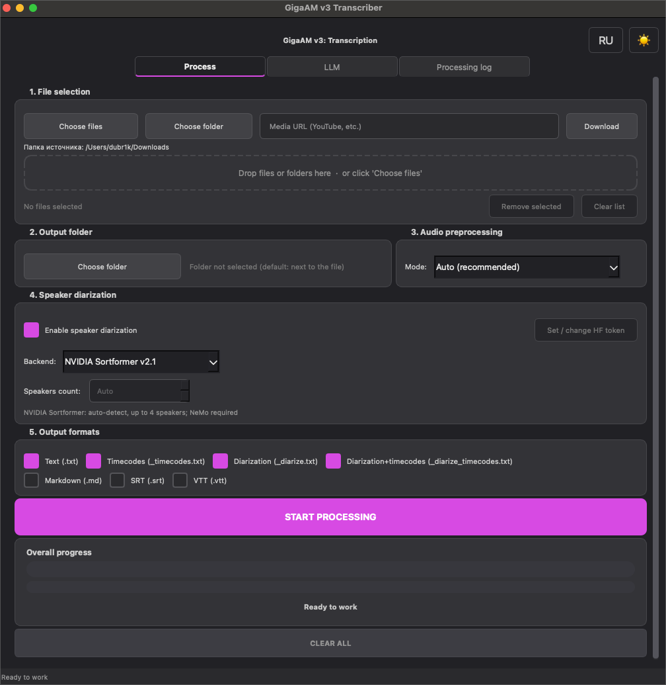
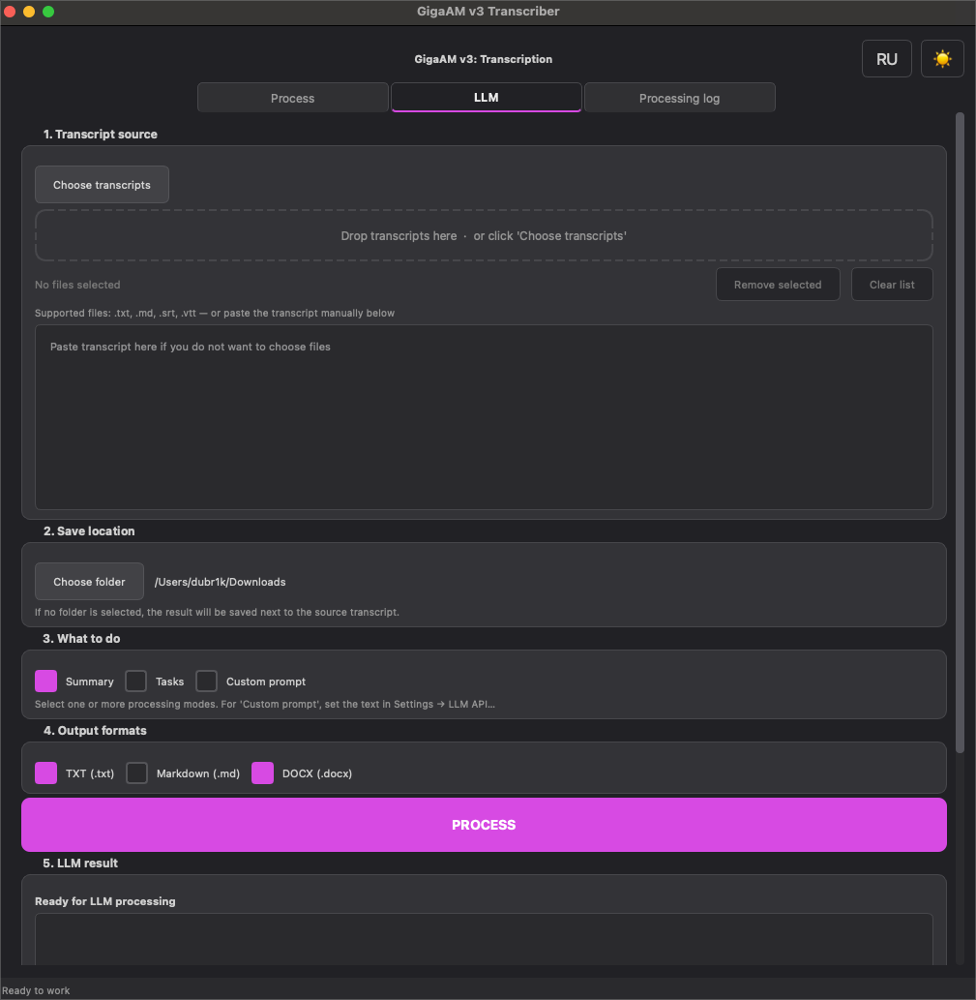
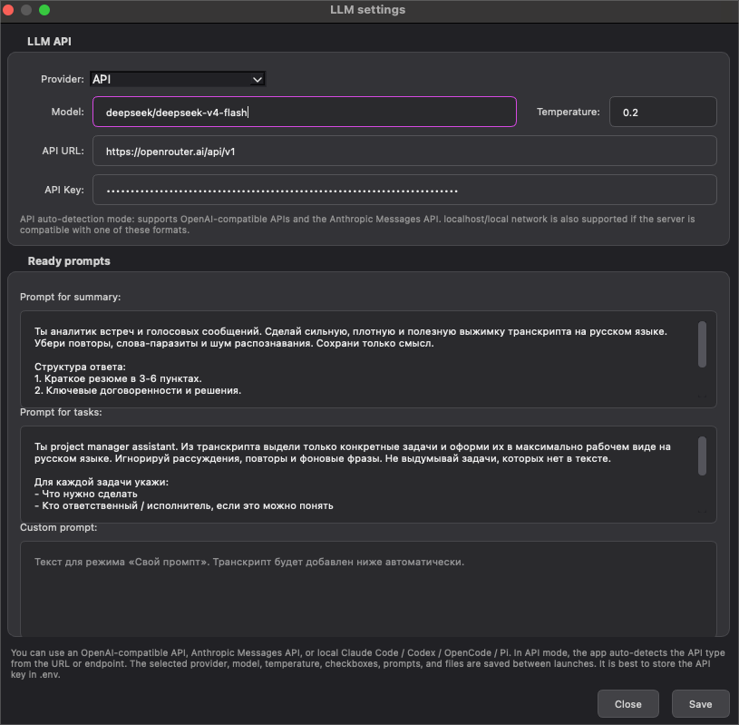

# GigaAM v3 Transcriber

[](https://www.python.org/)
[](https://www.riverbankcomputing.com/software/pyqt/)
[](https://fastapi.tiangolo.com/)
[](https://www.docker.com/)
[](https://github.com/dubr1k/GigaAMGUI/stargazers)

[🇷🇺 Русская версия](README.md) · **🇺🇸 English**

Russian speech-to-text transcription for audio and video powered by **GigaAM-v3**. One shared service layer with five interfaces: Desktop GUI, CLI, REST API, Web GUI, and terminal TUI.

> GigaAM Transcriber is a complete workflow for transcription, export, diarization, and LLM post-processing—not just a model wrapper.

## Contents

- [Features](#features)
- [Quick start](#quick-start)
- [Interfaces](#interfaces)
- [Configuration](#configuration)
- [Intelligent audio preprocessing](#intelligent-audio-preprocessing)
- [ASR backend](#asr-backend)
- [Offline builds](#offline-builds)
- [Project layout](#project-layout)
- [Screenshots](#screenshots)
- [Credits](#credits)

## Features

- Batch processing, recursive folder scans, drag & drop, and media downloads through `yt-dlp`.
- Export to `txt`, `txt_timecodes`, `txt_diarize`, `txt_diarize_timecodes`, `md`, `srt`, and `vtt`.
- SRT/VTT are split into short phrases using punctuation and word timestamps;
  line count and line width are configurable without changing TXT/MD output.
- Selectable diarization through `pyannote`, ONNX PyAnnote + WeSpeaker, or NVIDIA Streaming Sortformer v2.1.
- Automatic quality diagnostics, conservative cleanup, and timeline-safe fallback.
- MLX RNN-T on Apple Silicon; CPU, CUDA, Intel XPU, and MPS support.
- LLM summaries, action items, and custom prompts.
- OpenAI-compatible API, Claude Code, Codex, OpenCode, Pi, and arbitrary CLI LLM providers.
- RU/EN, light/dark themes, logs, stage-aware progress, and queue cancellation.
- Authenticated Web UI with SSE progress, restored tasks, and Docker hardening.

## Quick start

### 1. Install dependencies

```bash
git clone https://github.com/dubr1k/GigaAMGUI.git
cd GigaAMGUI
cp .env.example .env
python -m pip install -r requirements.txt
ffmpeg -version
```

### 2. Set a Hugging Face token

```env
HF_TOKEN=your_huggingface_token_here
```

For diarization, accept the terms for `pyannote/speaker-diarization-3.1` and `pyannote/segmentation-3.0`.

### Optional: NVIDIA Sortformer

The full macOS `.app` already bundles Sortformer and NeMo. When running from
source, install Sortformer separately so the heavy NeMo stack does not inflate
the default installation:

```bash
python -m pip install -r requirements-sortformer.txt
python cli.py --diarize --diarization-backend sortformer -f audio.wav
```

This uses `nvidia/diar_streaming_sortformer_4spk-v2.1` with the official
high-latency model-card settings. The model auto-detects active
speakers, supports at most four voices, and does not require `HF_TOKEN`.
ASR-model-independent diarization was verified with `v3_e2e_rnnt`,
`multilingual_ctc` (220M), and `multilingual_large_ctc` (600M). Both CTC models
use the PyTorch backend.
CUDA is recommended; CPU is much slower. On Apple Silicon, Sortformer runs on
MPS. If a particular NeMo operation fails on MPS, the application retries once
on CPU and records the fallback reason in the processing log. The model
(~471 MB) is downloaded after the first **Start processing** click with
Sortformer selected and remains in the user cache. The Space's NeMo 2.5.3 pin
is intentionally avoided because later releases fix known vulnerabilities; the
optional requirements file pins the reviewed 2.7 branch.
For the Web UI, build the extended image with
`INSTALL_SORTFORMER=1 docker compose build gigaam-web`.

## Interfaces

| Interface | Start | Use case |
|---|---|---|
| Desktop GUI | `python app.py` | Regular interactive work |
| CLI | `python cli.py -f audio.wav -o output` | Scripts and automation |
| REST API | `python api.py` | Integrations; docs at `http://127.0.0.1:8000/docs` |
| Web GUI | `docker compose up -d --build gigaam-web` | Local web panel at `http://127.0.0.1:8001/` |
| TUI *(preview)* | `cd tui && cargo run --release` | Interactive terminal queue |

### TUI

```bash
curl -fsSL https://raw.githubusercontent.com/dubr1k/GigaAMGUI/main/scripts/install_tui.sh | bash
gigaam
```

### Subtitle settings

Desktop GUI and Web UI expose subtitle controls next to the SRT/VTT formats.
The CLI accepts `--subtitle-sentence-split/--no-subtitle-sentence-split`,
`--subtitle-max-lines`, and `--subtitle-max-width`:

```bash
python cli.py -f audio.wav --format srt --format vtt \
  --subtitle-sentence-split --subtitle-max-lines 2 --subtitle-max-width 64
```

The TUI provides `/subtitle-split on|off`, `/subtitle-lines 1..4`, and
`/subtitle-width 20..100`; these values persist between runs. Cue boundaries use
word timestamps when available, with deterministic timing inside the original
ASR segment as the fallback. The width limit also includes speaker markup; at
extremely narrow widths, long speaker labels are compacted while preserving
their identifying suffix.

## Configuration

### Data and model directory

Set `GIGAAM_DATA_DIR` to place every large download on a drive of your choice.
The application creates `runtimes` plus dedicated `models/gigaam`,
`models/huggingface`, `models/onnx`, `models/torch`, `models/nemo`, and
`models/deepfilter` subdirectories. This covers the PyTorch runtime, GigaAM,
ONNX/MLX, Pyannote/Sortformer, NeMo, and DeepFilterNet.

- **Desktop GUI:** use `Settings → Data and model directory…`. Portable builds
  also offer this choice before the first download. Restart after changing it;
  existing models are deliberately not moved automatically.
- **GUI/CLI:** `python app.py --data-dir /mnt/large/GigaAMData` or
  `python cli.py --data-dir /mnt/large/GigaAMData ...`.
- **TUI:** `gigaam --data-dir /mnt/large/GigaAMData`.
- **REST API/Web:** set `GIGAAM_DATA_DIR` before server startup. With Docker
  Compose it is the selected **host** path:

```bash
GIGAAM_DATA_DIR=/mnt/large/GigaAMData docker compose up -d --build gigaam-web
```

Specialized variables (`HF_HOME`, `HUGGINGFACE_HUB_CACHE`, `TRANSFORMERS_CACHE`,
`TORCH_HOME`, `NEMO_HOME`, `ONNX_MODEL_DIR`, `GIGAAM_RUNTIME_DIR`, `GIGAAM_CONFIG_DIR`,
`GIGAAM_PYTORCH_MODEL_DIR`, and `GIGAAM_DEEPFILTER_DIR`) retain priority for
advanced layouts. On Windows, keep model/runtime paths free of Cyrillic
characters because some native DLL loaders cannot handle them reliably.

Small user settings stay in the system config directory so changing disks does
not reset language, tokens, or processing preferences. Set `GIGAAM_CONFIG_DIR`
separately when a fully self-contained configuration is required.

For the Web UI, configure `.env`:

```env
WEB_SECRET=change_me
WEB_USERNAME=admin
WEB_PASSWORD=replace_with_strong_password
```

For RTX 50xx / Blackwell, install a compatible PyTorch build first:

```bash
python -m pip install torch==2.8.0 torchvision==0.23.0 torchaudio==2.8.0 --index-url https://download.pytorch.org/whl/cu128
python -m pip install -r requirements.txt
```

## Intelligent audio preprocessing

`AUDIO_PREPROCESSING_MODE=auto` is the default. The application measures
loudness, noise floor, estimated SNR, clipping, silence, DC offset, spectral
flatness, and low-frequency noise. It then selects pass-through, normalization,
light FFmpeg cleanup, or neural denoising. A second analysis rejects candidates
that increase clipping, erase speech, fail to improve measurable noise, or alter
duration. The enhanced track is used only for ASR; diarization keeps the aligned
canonical track and pauses are never removed.

For severe broadband noise, the official self-contained DeepFilterNet 0.5.6
binary is downloaded on demand, verified against a pinned SHA-256, and stored in
the runtime cache. No DeepFilterNet Python dependency is installed. Any download,
platform, or inference failure falls back to the canonical audio.

```env
AUDIO_PREPROCESSING_MODE=auto  # off | auto | light | denoise
# GIGAAM_DEEPFILTER_DIR=/writable/executable/cache
```

```bash
python cli.py --audio-preprocessing auto -f noisy.wav
```

## ASR backend

On macOS Apple Silicon, `auto` uses [gigaam-mlx](https://github.com/aystream/gigaam-mlx) and falls back to PyTorch when necessary. On other platforms, `auto` currently keeps PyTorch as the validated default. The new `onnx` backend uses `onnx-asr==0.12.0`, does not import PyTorch, and supports CPU, CUDA, TensorRT, CoreML, and DirectML.

Portable 1.3.1 builds align ONNX acceleration with the selected device:

- Windows/Linux ship one `onnxruntime-gpu` distribution. `auto` resolves
  `CUDAExecutionProvider → CPUExecutionProvider` and reuses CUDA/cuDNN from the
  selected hot-swappable PyTorch runtime (`cu124`/`cu128`), so ASR and
  Sortformer do not unexpectedly use different devices;
- macOS ships the regular `onnxruntime` and resolves
  `CoreMLExecutionProvider → CPUExecutionProvider`;
- DirectML and TensorRT remain explicit advanced choices and are accepted only
  when the installed ONNX Runtime exposes them.

Selecting CPU never downloads a CUDA runtime. An already selected and installed
CUDA runtime is activated before provider discovery, and the actual provider
chain is printed in the model-preparation log.

```bash
python cli.py --backend auto -f audio.wav
python cli.py --backend mlx -f audio.wav
python cli.py --backend onnx --onnx-provider auto -f audio.wav
python cli.py --backend pytorch -f audio.wav
```

The same settings are available in the Desktop GUI and Web UI. The REST API
accepts them as optional query parameters and uses server defaults when omitted:

```bash
curl -H "X-API-Key: $GIGAAM_API_KEY" \
  -F "file=@audio.wav" \
  "http://127.0.0.1:8000/api/v1/transcribe?asr_backend=onnx&asr_model=v3_e2e_rnnt&onnx_provider=coreml"
```

Use `GET /api/v1/asr/options` for accepted values and active configuration.
A selection different from the server default gets an isolated task loader and
does not reconfigure concurrent requests.

ONNX diarization is also available without PyTorch or an HF token:

```bash
python cli.py --backend onnx --diarize --diarization-backend onnx -f audio.wav
```

It preserves overlapping-speech powerset classes, extracts WeSpeaker embeddings, and performs constrained clustering. Pyannote and Sortformer remain validated fallback backends; ONNX becomes the default only after the local WER/CER and DER/JER quality gates pass. Native Windows always routes Sortformer through ONNX without NeMo. Linux/macOS use native NeMo when it is installed and otherwise select portable ONNX automatically. ONNX Sortformer uses CUDA→CPU on Windows/Linux and CoreML→CPU on macOS.

Run comparisons on a local licensed corpus:

```bash
python scripts/benchmark_asr_backends.py corpus/asr.json --backend onnx --backend pytorch --output asr-metrics.json
python scripts/benchmark_diarization_backends.py corpus/diarization.json --backend onnx --backend pyannote --output diarization-metrics.json
```

## Offline builds

Each release provides two variants:

- the standard build checks the selected ASR, preprocessing, and diarization
  chain after **Start processing**, logs every cache check/download/load and the
  selected device/provider, then downloads only missing artifacts;
- `*-offline.zip` includes the base ONNX ASR, VAD, and
  Pyannote+WeSpeaker diarization chain in a read-only `models` directory next to
  the executable.

Sortformer, multilingual/MLX models, and gated pyannote models not present in
the offline bundle are downloaded to the writable user cache when selected and
network access is available. Pyannote still requires a valid read `HF_TOKEN`
and accepted terms for every gated repository. Preparation runs once before the
first file in a batch; a component-specific error stops the queue before
processing starts.

## Project layout

```text
GigaAMGUI/
├── app.py                 # PyQt desktop app
├── cli.py                 # scripting CLI
├── api.py                 # REST API
├── src/                   # core, services, GUI mixins, utilities
├── tui/                   # Ratatui frontend
├── web/                   # FastAPI Web UI
├── tests/
├── packaging/
├── assets/
├── Dockerfile
└── docker-compose.yml
```

## Screenshots

| Processing | LLM | LLM settings |
|---|---|---|
|  |  |  |

## Credits

- [SaluteDevices / GigaAM](https://github.com/salute-developers/GigaAM)
- [GigaAM-v3 on Hugging Face](https://huggingface.co/ai-sage/GigaAM-v3)
- [aystream / gigaam-mlx](https://github.com/aystream/gigaam-mlx)
- [NVIDIA Streaming Sortformer v2.1](https://huggingface.co/nvidia/diar_streaming_sortformer_4spk-v2.1)
- [DeepFilterNet](https://github.com/Rikorose/DeepFilterNet) — MIT, optional neural noise suppression
